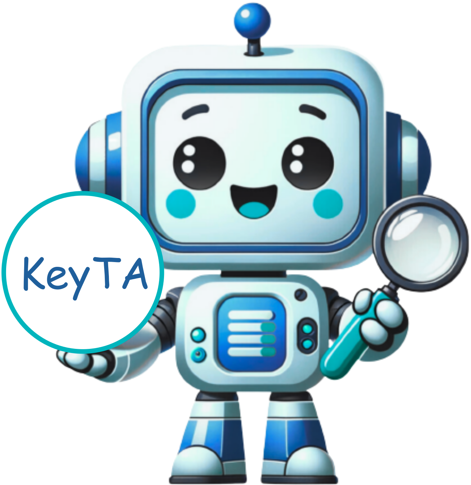
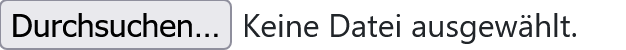
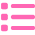

# KeyTA



**KeyTA** wurde entwickelt, um die Testautomatisierung mit Robot Framework zu vereinfachen. Es werden keine Programmier- und nur grundlegende Testkenntnisse benötigt.

Es können *Testfälle* erstellt werden, die aus *Sequenzen* bestehen. Sequenzen bestehen aus *Aktionen* und Schlüsselwörtern aus importierten .resource-Dateien. Aktionen bestehen aus Schlüsselwörtern aus importierten Robot Framework-Bibliotheken.

Die Schritte der *Aktionen*, *Sequenzen* und *Testfälle* können mühelos per Drag-and-Drop in verschiedene Reihenfolgen gebracht werden. Die *Aktionen*, *Sequenzen* und *Testfälle* können direkt aus dem Browser ausgeführt werden. Testfälle können außerdem als .robot-Datei exportiert werden.

## Übersicht 

- [Bibliotheken](#bibliotheken)
- [Ressourcen](#ressourcen)
- [Systeme](#systeme)
- [Masken](#masken)
- [Referenzwerte](#referenzwerte)
- [Aktionen](#aktionen)
- [Sequenzen](#sequenzen)
- [Testfälle](#testfälle)
- [Arbeitsablauf](#arbeitsablauf)

## Bibliotheken 
[Zurück zur Übersicht](#übersicht)

Die RF BuiltIn-Bibliothek ist vorhanden. Die übrigen Standard RF-Bibliotheken können nach Bedarf importiert werden. Alle andere Bibliotheken müssen im Vorfeld mit pip installiert bzw. dem PYTHONPATH [hinzugefügt](#konfiguration-vom-pythonpath) werden.

Falls eine Bibliothek über Initialisierungsparameter verfügt, können die entsprechenden Standardwerte im Reiter "Einstellungen" konfiguriert werden.

Wenn eine andere Version einer bereits importierten Bibliothek im PYTHONPATH vorhanden ist, kann sie in KeyTA übernommen werden. Dafür muss man in der Liste der Bibliotheken auf das Symbol in der Spalte "Aktualisierung" klicken. Dabei werden die Dokumentation, die Initialisierungsparameter und die Schlüsselwörter synchronisiert. 

### Eine Bibliothek importieren

1. Im Dashboard oder an der Seitenleiste "Bibliotheken" auswählen, auf den Knopf "Bibliothek hinzufügen" klicken.


2. Den Namen der Bibliothek ins Namensfeld eintragen (z.B. "RoboSAPiens.DE" zur Automatisierung von SAP-Anwendungen).

3. Auf den Speicher-Knopf oder die Enter-Taste drücken.


Die Bibliothek wurde hinzugefügt. 

## Ressourcen
[Zurück zur Übersicht](#übersicht)

### Eine Ressource importieren

1. Im Dashboard oder an der Seitenleiste "Ressourcen" auswählen, auf den Knopf "Ressource hinzufügen" klicken. 


2. Die .resource-Datei mit dem "Durchsuchen"-Knopf im Dateisystem suchen und auswählen.


3. Auf den Speicher-Knopf klicken.

4. Die Ressource wurde hinzugefügt. 

## Systeme
[Zurück zur Übersicht](#übersicht)

Ein System entspricht einem System Under Test (SUT). Zum Beispiel ein Mandant in SAP oder eine Webanwendung.

Ein SUT wird überwiegend mit nur einer Robot Framework-Bibliothek automatisiert. Diese muss bei der Anlage eines Systems verknüpft werden.

Zur Ausführung von Aktionen und Sequenzen wird ein laufendes SUT benötigt. Die Aktion zur Anbindung an das SUT muss bei der Anlage eines Systems verknüpft werden.


### Ein System hinzufügen 

1. Im Dashboard oder an der Seitenleiste "Systeme" auswählen, auf den Knopf "System hinzufügen" klicken. 


2. Name und Beschreibung müssen angegeben werden. 

3. In der Dropdown-Liste "Automatisierung" muss die Bibliothek ausgewählt werden, mit der das System automatisiert werden soll. 

4. Auf den Speicher-Knopf klicken. 

5. In "Anbindung an laufendes System" muss eine Aktion ausgewählt werden, die für die [Ausführung](#ausführung) verwendet wird.

## Masken
[Zurück zur Übersicht](#übersicht)

Masken sind die Grundlage für die Testfälle in KeyTA. Ein Testfall wird aus einer Reihenfolge von Masken aufgebaut, ähnlich wie ein Film.

Dementsprechend müssen Aktionen, Sequenzen und Referenzwerte mit einer Maske verknüpft werden. Aus diesem Grund muss die Anlage der Maske zuvor stattfinden.

### Eine Maske hinzufügen

1. Im Dashboard oder an der Seitenleiste "Masken" auswählen, auf den Knopf "Maske hinzufügen" klicken. 


2. System muss ausgewählt, Name und Dokumentation müssen ausgefüllt werden. 

3. Auf den Speicher-Knopf klicken.


## Aktionen
[Zurück zur Übersicht](#übersicht)

Aktionen bilden die erste fachliche Ebene über die technischen Schlüsselwörter. Eine Aktion ist ein einzelner Schritt, wie zum Beispiel einen Knopf drücken oder ein Textfeld ausfüllen. 

Jede Aktion findet in einer Maske statt. Zwecks Wiederverwendbarkeit kann eine Aktion mehreren Masken zugeordnet und nach Bedarf auch für alle Masken freigegeben werden. Dafür muss bei der Anlage das Häkchen "in allen Masken" gesetzt werden. Außerdem kann eine Aktion mehreren Systemen zugeordnet werden.

Ausgewählte Aktionen können als Vor- oder Nachbereitungsschritte verwendet werden, indem bei der Anlage das Häkchen "Vor-/Nachbereitung" gesetzt wird.

Eine Aktion, die in allen Masken und als Vorbereitungsschritt verwendet werden darf, kann zur Anbindung an ein laufendes System verwendet werden (siehe [Ein System hinzufügen](#ein-system-hinzufügen)).


### Eine Aktion hinzufügen

1. Im Dashboard oder an der Seitenleiste "Aktionen" auswählen, auf den Knopf "Aktion hinzufügen" klicken. 


2. Es muss ein Name gegeben und mindestens ein System ausgewählt werden.

3. Auf den Speicher-Knopf klicken.

Falls "in allen Masken" **nicht** ausgewählt wurde, müssen nun im Reiter "Masken" diejenigen Masken gewählt werden, in denen die Aktion verwendet wird. 

Im Reiter "Bibliotheken" sind standardmäßig die Automatisierungsbibliotheken der der Aktion zugeordneten Systeme vorhanden. Falls eine Aktion eine zusätzliche Bibliothek benötigt, kann sie hinzugefügt werden.

Im Reiter "Parameter" können die Eingabedaten der Aktion definiert werden. Damit kann die Aktion mit verschiedenen Daten aufgerufen werden.

Im Reiter "Schritte" können die Schritte der Aktion hinzugefügt und sortiert werden. Jeder Schritt ist ein Aufruf eines Schlüsselworts aus einer Robot Framework-Bibliothek. 

Wenn ein Schlüsselwort Parameter benötigt und sie noch nicht definiert wurden, wird in der Spalte "Werte" das folgende Symbol angezeigt: 

Wenn alle Parameter definiert wurden, ist die Anzeige in der Spalte "Werte" blau: 

Beim Klicken auf das Symbol können die Parameter des Aufrufs definiert werden.
Hier gibt es mehrere Möglichkeiten: ein konstanter Wert, ein Parameter der aufrufenden Aktion, ein Rückgabewert eines vorherigen Aufrufs oder ein Referenzwert. Der Rückgabewert
des Aufrufs kann auch benannt werden.

## Sequenzen
[Zurück zur Übersicht](#übersicht)

Sequenzen bilden eine übergeordnete fachliche Ebene. Eine Sequenz besteht aus einer Reihe von Aktionen. Zum Beispiel, ein Formular ausfüllen. Anders als Aktionen kann eine Sequenz nur einer Maske zugeordnet werden. Da mehrere Sequenzen derselben Maske zugeordnet werden können, ist es möglich, in einer Maske verschiedene Abläufe abzubilden.

### Eine Sequenz hinzufügen

1. Im Dashboard oder an der Seitenleiste "Sequenzen" auswählen, auf den Knopf "Sequenz hinzufügen" klicken.


2. Die Sequenz benötigt einen Namen und die Zuordnung zu einem System und einer Maske. 

3. Auf den Speicher-Knopf klicken. 

Im Reiter "Ressourcen" können Ressourcen hinzugefügt werden, deren Schlüsselwörter in der Sequenz verwendet werden.

Der Reiter "Parameter" ist ähnlich wie bei einer Aktion.

Der Reiter "Schritte" ist ähnlich wie bei einer Aktion. Der einzige Unterschied ist, dass hier Aktionen und Schlüsselwörter aus den verknüpften Ressourcen zur Auswahl stehen.

## Testfälle
[Zurück zur Übersicht](#übersicht)

Ein Testfall besteht aus einer Reihe von Sequenzen. Da jede Sequenz einer Maske zugeordnet ist, muss zuerst eine Maske ausgewählt werden und danach die gewünschte Sequenz.

Ein Testfall kann systemübergreifend sein. Dementsprechend kann es mit mehreren Systemen verknüpft werden.

### Einen Testfall hinzufügen

1. Im Dashboard oder an der Seitenleiste "Testfälle" auswählen, auf den Knopf "Testfall hinzufügen" klicken. 


2. Es muss ein Name gegeben und mindestens ein System ausgewählt werden. 

3. Auf den Speicher-Knopf klicken. 

4. Nun können im Reiter "Schritte" die Masken und Sequenzen in den jeweiligen Masken ausgewählt werden, um einen Testfall zu bauen. 

## Referenzwerte
[Zurück zur Übersicht](#übersicht)

Referenzwerte sind wiederverwendbare Daten, sowohl technische Parameter als auch fachliche Testdaten.

Ein Referenzwert ist vergleichbar mit einem Robot Framework-Dictionary. Dementsprechend  besteht es aus einer Liste von Namen und zugehörigen Werten.

Zwecks Wiederverwendbarkeit kann ein Referenzwert mehreren Masken zugeordnet und nach Bedarf auch für alle Masken freigegeben werden. Dafür muss bei der Anlage das Häkchen "in allen Masken" gesetzt werden. 

Ein systemübergreifender Referenzwert kann mehreren Systemen zugeordnet werden. Systemunabhängige Referenzwerte werden keinem System zugeordnet. Diese sind in der Regel technische Parameter, wie zum Beispiel der Remote Debugging Port von einem Chromium-basierten Browser.

Ausgewählte Referenzwerte (wie z.B. die o.g. technischen Parameter) können in einem Vor- bzw. Nachbereitungsschritt verwendet werden, indem bei der Anlage das Häkchen "Vor-/Nachbereitung" gesetzt wird.

### Einen Referenzwert hinzufügen

1. Im Dashboard oder an der Seitenleiste "Referenzwerte" auswählen, auf den Knopf "Referenzwert hinzufügen" klicken. 


2. Der Name muss ausgefüllt werden. 

3. Im Reiter "Werte" muss mindestens ein Wert mit einem Namen eingetragen werden. 

## Ausführung
[Zurück zur Übersicht](#übersicht)

Anders als in Robot Framework können Aktionen und Sequenzen einzeln ausgeführt werden.
Falls sie Parameter haben, müssen sie im Reiter "Ausführung" mit Werten befüllt werden.

Vorbedingung für die Ausführung ist ein laufendes System Under Test. Dementsprechend wird vor dem Aufruf der Aktion bzw. Sequenz die Aktion zur Anbindung an das System ausgeführt. Diese kann beim Klicken auf "Einstellungen" angepasst werden. Standardmäßig wird die mit dem [System](#systeme) verknüpfte Aktion verwendet.

Bei der Ausführung eines Testfalls hingegen gibt es keinen vordefinierten Vorbereitungsschritt. Der Vor- und Nachbereitungsschritt müssen vor der ersten Ausführung gepflegt werden.

In den Einstellungen können auch die Initialisierungsparameter der verwendeten Bibliotheken konfiguriert werden.

Nach der Anpassung der Einstellungen kann die Ausführung beim Klicken auf den Play-Button gestartet werden. Wenn das Ergebnis vorliegt, wird in der Spalte "Ergebnis" ein grünes bzw. ein rotes Symbol angezeigt. Außerdem kann das Robot Framework-Protokoll mit einem Klick geöffnet werden. Das Protokoll öffnet sich in einem neuen Browser-Tab.

### Konfiguration vom PYTHONPATH

Die Ordner mit den verwendeten .resource-Dateien bzw. .py-Bibliotheken müssen dem PYTHONPATH hinzugefügt werden. Z.B. indem eine .pth-Datei im Ordner site-packages abgelegt wird. Der Pfad zum Ordner kann wie folgt ermittelt werden:

```bash
python -c 'import site; print(site.getsitepackages()[1])'
```

## Arbeitsablauf
[Zurück zur Übersicht](#übersicht)

### 1. Anlage eines Systems

1. Die Bibliothek zur Automatisierung des SUT importieren

2. System für das SUT anlegen

3. Die Aktion zur Anbindung ans laufende System anlegen und dem System zuordnen


### 2a. Fachlich -> Technisch

1. Masken anlegen

2. Sequenzen anlegen, die die fachlichen Abläufe darstellen

3. Einen Testfall anlegen und die Schritte hinzufügen

4. Die Aktionen anlegen, die in den Sequenzen benötigt werden


### 2b. Technisch -> Fachlich

1. Masken anlegen

2. Die Aktionen anlegen, die den einzelnen Schritten entsprechen

2. Sequenzen anlegen, die die fachlichen Abläufe darstellen

4. Einen Testfall anlegen und die Schritte hinzufügen
